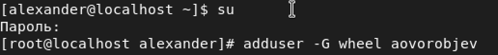
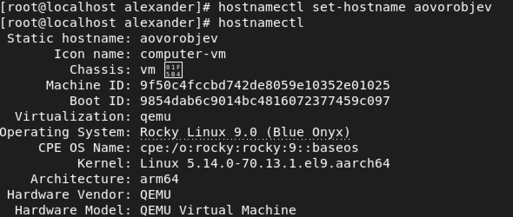

---
## Front matter
lang: ru-RU
title: Отчет по лабораторной работе №1.
subtitle: Установка и конфигурация операционной системы на виртуальную машину

author: |
	Alexander O. Vorobyov\inst{1}
	
institute: |
	\inst{1}RUDN University, Moscow, Russian Federation
	
date: 10 September, 2022

## Formatting
toc: false
slide_level: 2
theme: metropolis
header-includes: 
 - \metroset{progressbar=frametitle,sectionpage=progressbar,numbering=fraction}
 - '\makeatletter'
 - '\beamer@ignorenonframefalse'
 - '\makeatother'
aspectratio: 43
section-titles: true
---

# Прагматика выполнения

## Прагматика выполнения

Лабораторная работа выполняется для загрузки образа и установки  операционной системы на вирутальную машину. 

# Цель работы

## Цель работы

Целью данной работы является приобретение практических навыков установки операционной системы на виртуальную машину, настройки ми- нимально необходимых для дальнейшей работы сервисов.

# Задачи выполнения 

## Задачи выполнения  

1. Загрузил операционную систему linux Rocky и вошел в систему.  
{ #fig:001 width=70% } 
	
## Задачи выполнения  

2. Запустил виртуальную машину. 

{ #fig:005 width=70% }  
{ #fig:005 width=70% }  

## Задачи выполнения  

3. Изменил имя пользователя.  
{ #fig:005 width=70% }  

## Задачи выполнения 

4. Установил имя хоста и проверил, что имя хоста установлено верно.**  
{ #fig:005 width=70% }  

# Результаты выполнения 

## Результаты выполнения 

В результате проделанной работы я приобрел практические навыки установки операционной системы на виртуальную машину, настроил минимально необходимое для дальнейшей работы сервисов.

