---
## Front matter
lang: ru-RU
title: Отчет по лабораторной работе №2
subtitle: Дискреционное разграничение прав в Linux. Основные атрибуты

author: |
	Alexander O. Vorobyov\inst{1}
	
institute: |
	\inst{1}RUDN University, Moscow, Russian Federation
	
date: 13 September, 2022

## Formatting
toc: false
slide_level: 2
theme: metropolis
header-includes: 
 - \metroset{progressbar=frametitle,sectionpage=progressbar,numbering=fraction}
 - '\makeatletter'
 - '\beamer@ignorenonframefalse'
 - '\makeatother'
aspectratio: 43
section-titles: true
---

# Цель работы

## Цель работы

Получение практических навыков работы в консоли с атрибутами файлов, закрепление теоретических основ дискреционного разграничения доступа в современных системах с открытым кодом на базе ОС Linux

# Выполнение работы  

## 1. В установленной при выполнении предыдущей лабораторной работы операционной системе создайте учётную запись пользователя guest (используя учётную запись администратора): useradd guest.

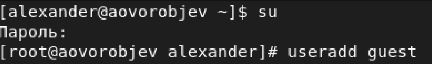{ #fig:001 width=70% } 

## 2. Задайте пароль для пользователя guest (использую учётную запись ад- министратора): passwd guest.  

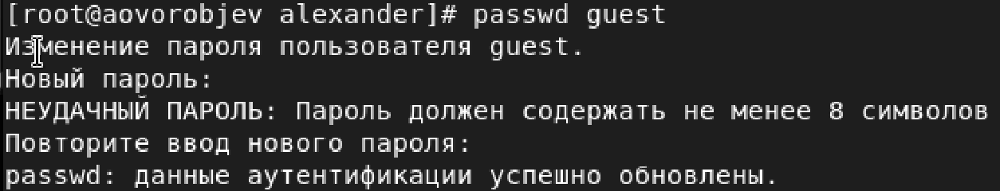{ #fig:002 width=70% }   

## 3. Войдите в систему от имени пользователя guest.  
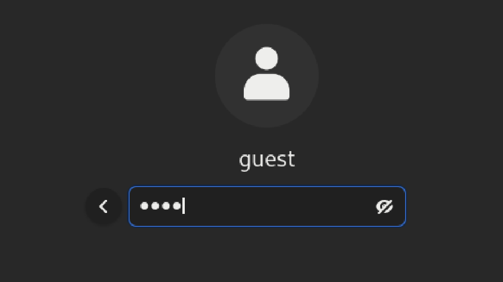{ #fig:003 width=70% }  

## 4. Определите директорию, в которой вы находитесь, командой pwd.  
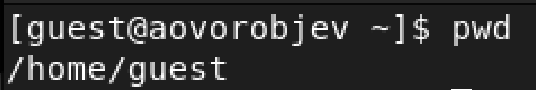{ #fig:004 width=70% }  

## 5. Уточните имя вашего пользователя командой whoami.  
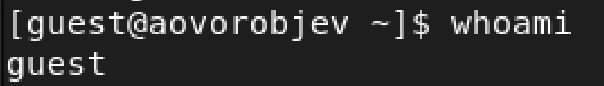{ #fig:005 width=70% }  

## 6. Уточните имя вашего пользователя, его группу, а также группы, куда входит пользователь, командой id. Выведенные значения uid, gid и др. запомните. Сравните вывод id с выводом команды groups.  
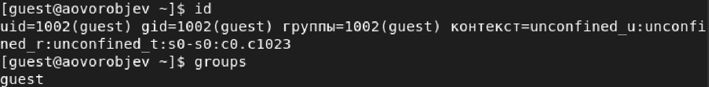{ #fig:006 width=70% }  

## 7. Сравните полученную информацию об имени пользователя с данными, выводимыми в приглашении командной строки.

## 8. Просмотрите файл /etc/passwd командой cat /etc/passwd.  
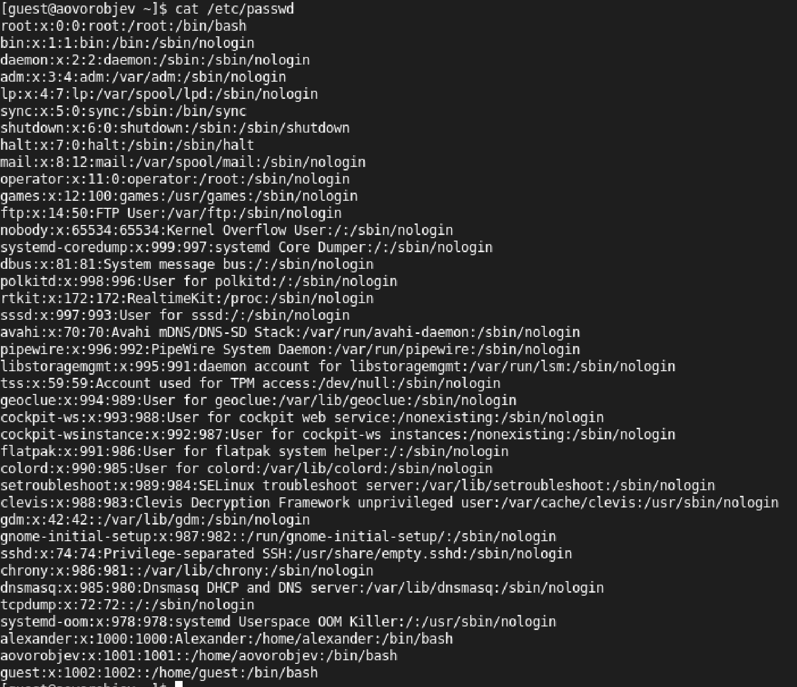{ #fig:007 width=70% }  

## 9. Определите существующие в системе директории командой ls -l /home/.  
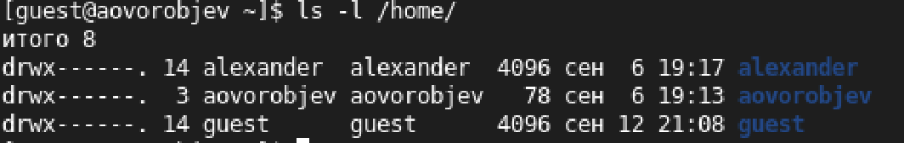{ #fig:008 width=70% }  

## 10. Проверьте, какие расширенные атрибуты установлены на поддиректориях, находящихся в директории /home, командой: lsattr /home.  
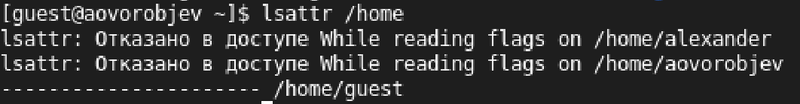{ #fig:009 width=70% }  

## 11. Создайте в домашней директории поддиректорию dir1 командой mkdir dir1.  
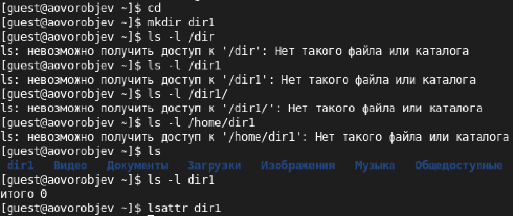{ #fig:010 width=70% }  

## 12. Снимите с директории dir1 все атрибуты командой chmod 000 dir1.  
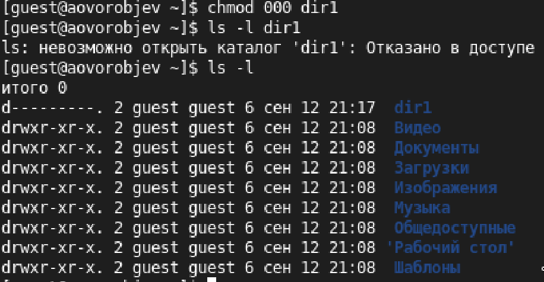{ #fig:011 width=70% } 

## 13. Попытайтесь создать в директории dir1 файл file1 командой echo "test" > /home/guest/dir1/file1.  
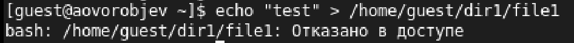{ #fig:012 width=70% }  

## 14. Заполните таблицу «Установленные права и разрешённые действия», выполняя действия от имени владельца директории (файлов), определив опытным путём, какие операции разрешены, а какие нет. Если операция разрешена, занесите в таблицу знак «+», если не разрешена, знак «-».  
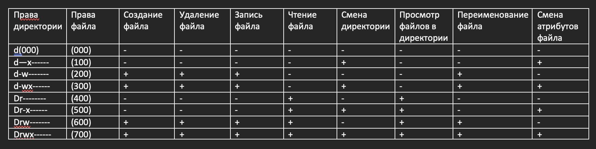{ #fig:013 width=70% }  

## 15. На основании заполненной таблицы определите те или иные минимально необходимые права для выполнения операций внутри директории dir1, заполните таблицу.  
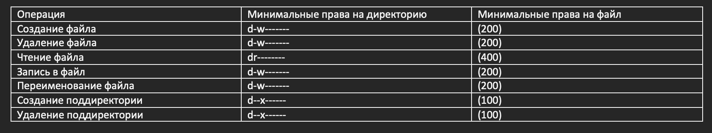{ #fig:014 width=70% }   

# Выводы

## Выводы

Получил практические навыкы работы в консоли с атрибутами файлов, закрепил теоретические основы дискреционного разграничения доступа в современных системах с открытым кодом на базе ОС Linux

