---
# Front matter
title: "Отчёт по лабораторной работе №2"
subtitle: "Дискреционное разграничение прав в Linux. Основные атрибуты"
author: "Александр Олегович Воробьев"

# Generic otions
lang: ru-RU
toc-title: "Содержание"

# Bibliography
bibliography: bib/cite.bib
csl: pandoc/csl/gost-r-7-0-5-2008-numeric.csl

# Pdf output format
toc: true # Table of contents
toc_depth: 2
lof: true # List of figures
lot: true # List of tables
fontsize: 12pt
linestretch: 1.5
papersize: a4
documentclass: scrreprt
## I18n
polyglossia-lang:
  name: russian
  options:
	- spelling=modern
	- babelshorthands=true
polyglossia-otherlangs:
  name: english
### Fonts
mainfont: PT Serif
romanfont: PT Serif
sansfont: PT Sans
monofont: PT Mono
mainfontoptions: Ligatures=TeX
romanfontoptions: Ligatures=TeX
sansfontoptions: Ligatures=TeX,Scale=MatchLowercase
monofontoptions: Scale=MatchLowercase,Scale=0.9
## Biblatex
biblatex: true
biblio-style: "gost-numeric"
biblatexoptions:
  - parentracker=true
  - backend=biber
  - hyperref=auto
  - language=auto
  - autolang=other*
  - citestyle=gost-numeric
## Misc options
indent: true
header-includes:
  - \linepenalty=10 # the penalty added to the badness of each line within a paragraph (no associated penalty node) Increasing the value makes tex try to have fewer lines in the paragraph.
  - \interlinepenalty=0 # value of the penalty (node) added after each line of a paragraph.
  - \hyphenpenalty=50 # the penalty for line breaking at an automatically inserted hyphen
  - \exhyphenpenalty=50 # the penalty for line breaking at an explicit hyphen
  - \binoppenalty=700 # the penalty for breaking a line at a binary operator
  - \relpenalty=500 # the penalty for breaking a line at a relation
  - \clubpenalty=150 # extra penalty for breaking after first line of a paragraph
  - \widowpenalty=150 # extra penalty for breaking before last line of a paragraph
  - \displaywidowpenalty=50 # extra penalty for breaking before last line before a display math
  - \brokenpenalty=100 # extra penalty for page breaking after a hyphenated line
  - \predisplaypenalty=10000 # penalty for breaking before a display
  - \postdisplaypenalty=0 # penalty for breaking after a display
  - \floatingpenalty = 20000 # penalty for splitting an insertion (can only be split footnote in standard LaTeX)
  - \raggedbottom # or \flushbottom
  - \usepackage{float} # keep figures where there are in the text
  - \floatplacement{figure}{H} # keep figures where there are in the text
---

# Цель работы

Получение практических навыков работы в консоли с атрибутами файлов, закрепление теоретических основ дискреционного разграничения доступа в современных системах с открытым кодом на базе ОС Linux.

# Выполнение лабораторной работы

**1. В установленной при выполнении предыдущей лабораторной работы
операционной системе создайте учётную запись пользователя guest (используя учётную запись администратора): useradd guest.** 

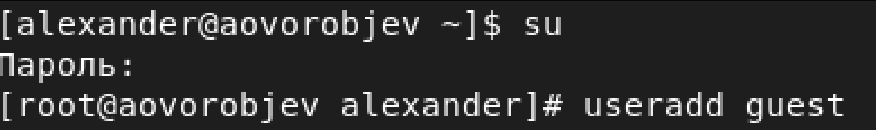{ #fig:001 width=70% } 

**2. Задайте пароль для пользователя guest (использую учётную запись ад- министратора): passwd guest.**  

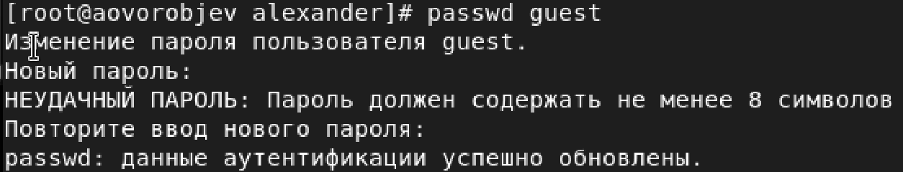{ #fig:002 width=70% }   

**3. Войдите в систему от имени пользователя guest.**  
{ #fig:003 width=70% }  

**4. Определите директорию, в которой вы находитесь, командой pwd.**  
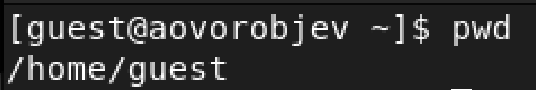{ #fig:004 width=70% }  

**5. Уточните имя вашего пользователя командой whoami.**  
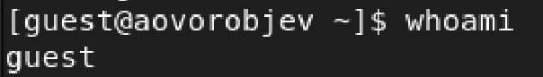{ #fig:005 width=70% }  

**6. Уточните имя вашего пользователя, его группу, а также группы, куда входит пользователь, командой id. Выведенные значения uid, gid и др. запомните. Сравните вывод id с выводом команды groups.**  
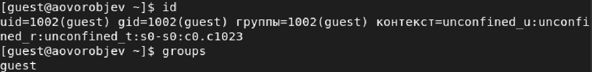{ #fig:006 width=70% }  

**7. Сравните полученную информацию об имени пользователя с данными,
выводимыми в приглашении командной строки.**

**8. Просмотрите файл /etc/passwd командой cat /etc/passwd.**  
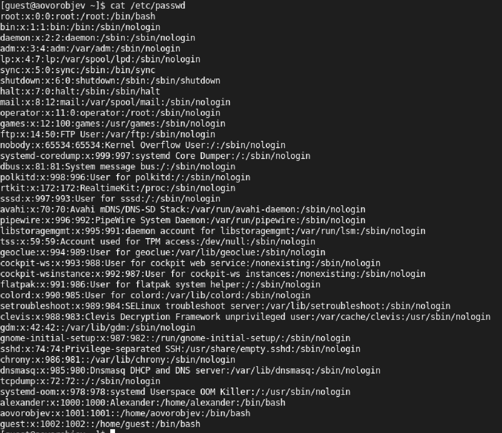{ #fig:007 width=70% }  

**9. Определите существующие в системе директории командой ls -l /home/.**  
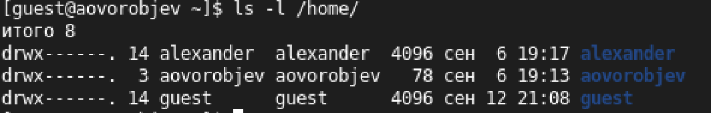{ #fig:008 width=70% }  

**10. Проверьте, какие расширенные атрибуты установлены на поддиректориях, находящихся в директории /home, командой: lsattr /home.**  
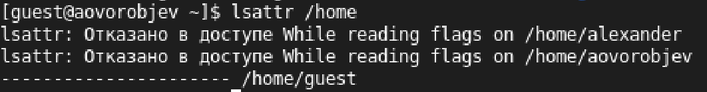{ #fig:009 width=70% }  

**11. Создайте в домашней директории поддиректорию dir1 командой mkdir dir1.**  
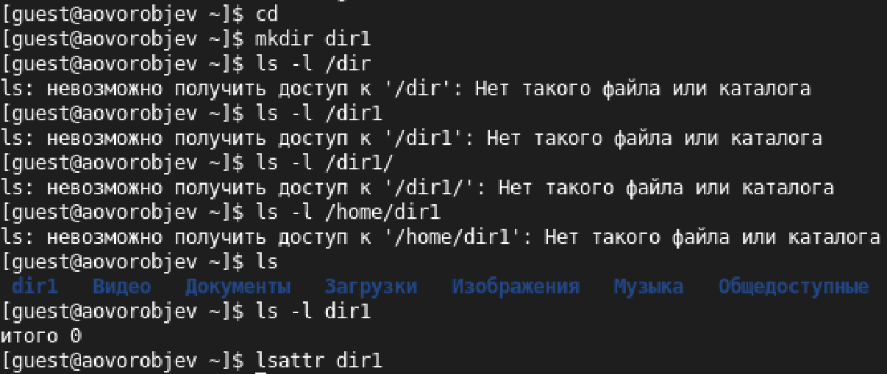{ #fig:010 width=70% }  

**12. Снимите с директории dir1 все атрибуты командой chmod 000 dir1.**  
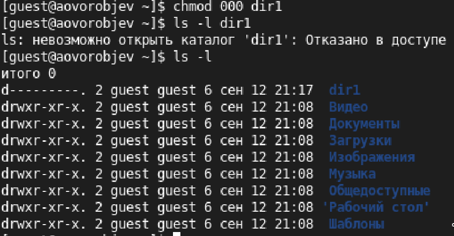{ #fig:011 width=70% } 

**13. Попытайтесь создать в директории dir1 файл file1 командой echo "test" > /home/guest/dir1/file1.**  
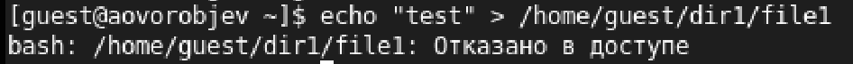{ #fig:012 width=70% }  

**14. Заполните таблицу «Установленные права и разрешённые действия», выполняя действия от имени владельца директории (фай- лов), определив опытным путём, какие операции разрешены, а какие нет. Если операция разрешена, занесите в таблицу знак «+», если не разре- шена, знак «-».**  
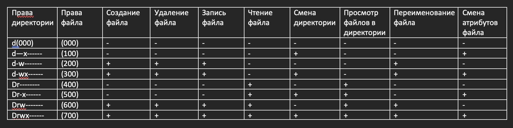{ #fig:013 width=70% }  

**15. На основании заполненной таблицы определите те или иные минимально необходимые права для выполнения операций внутри директории dir1, заполните таблицу.**  
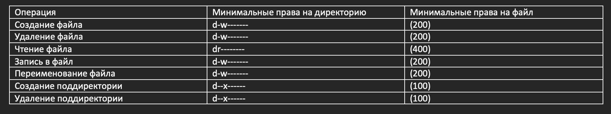{ #fig:014 width=70% }  

# Выводы

Получил практические навыкы работы в консоли с атрибутами файлов, закрепил теоретические основы дискреционного разграничения доступа в современных системах с открытым кодом на базе ОС Linux.

# Список литературы{.unnumbered}

	1. Кулябов Д.С. Лабораторная работа No 2. Дискреционное разграничение прав в Linux. Основные атрибуты [Электронный ресурс] - 10 с.

::: {#refs}
:::
