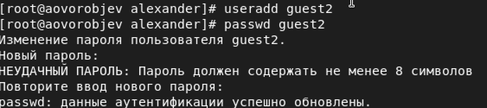
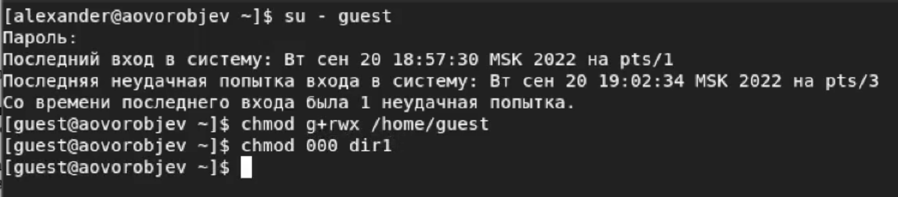
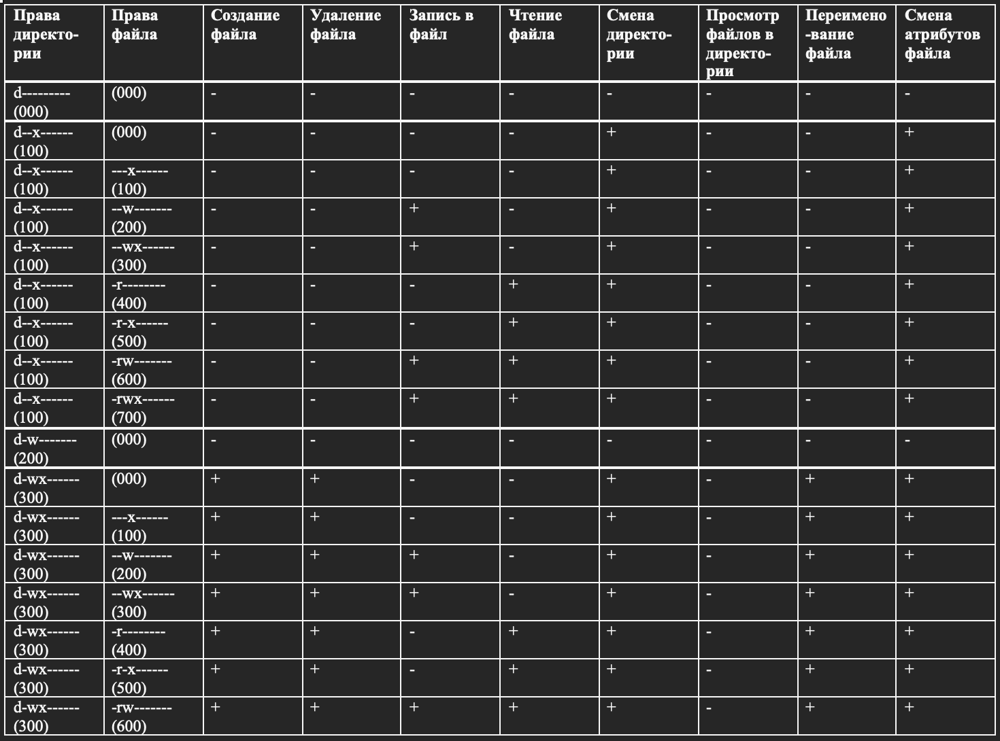
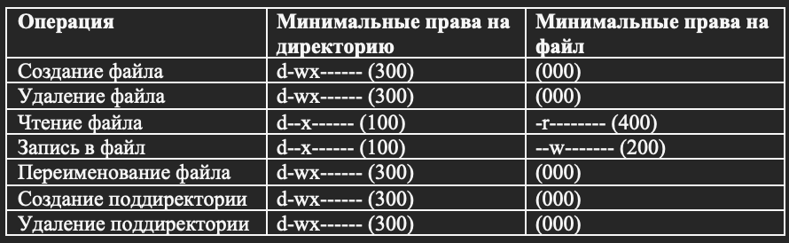

---
## Front matter
lang: ru-RU
title: Дискреционное разграничение прав в Linux. Два пользователя
author: Александр Воробьев

institute: RUDN University

date: 20 сентября, 2022, Москва, Россия

## Formatting
mainfont: PT Serif
romanfont: PT Serif
sansfont: PT Sans
monofont: PT Mono
toc: false
slide_level: 2
theme: metropolis
header-includes:
 - \metroset{progressbar=frametitle,sectionpage=progressbar,numbering=fraction}
 - '\makeatletter'
 - '\beamer@ignorenonframefalse'
 - '\makeatother'
aspectratio: 43
section-titles: true

---

# Цель лабораторной работы

Получение практических навыков работы в консоли с атрибутами файлов для групп пользователей

# Процесс выполнения лабораторной работы

## Выполнение работы

1. Создать пользователя guest и guest2

2. Полученить практические навыки работы с атрибутами файлов

3. Закрепить теоретические основы дискреционного разграничения доступа

## Создание нового пользователя

### Результат

{ #fig:001 width=70% }

## Получение практических навыков работы с атрибутами файлов

### Результат

{ #fig:002 width=70% }

## Закрепление теоретических основ дискреционного разграничения доступа

### Результат

{ #fig:003 width=40% }

{ #fig:004 width=40% }

# Выводы

Получение практических навыков работы в консоли с атрибутами файлов для групп пользователей