---
## Front matter
lang: ru-RU
title: Дискреционное разграничение прав в Linux. Расширенные атрибуты"
author: Александр Воробьев

institute: RUDN University

date: 28 сентября, 2022, Москва, Россия

## Formatting
mainfont: PT Serif
romanfont: PT Serif
sansfont: PT Sans
monofont: PT Mono
toc: false
slide_level: 2
theme: metropolis
header-includes:
 - \metroset{progressbar=frametitle,sectionpage=progressbar,numbering=fraction}
 - '\makeatletter'
 - '\beamer@ignorenonframefalse'
 - '\makeatother'
aspectratio: 43
section-titles: true

---

# Цель лабораторной работы

Получение практических навыков работы в консоли с расширенными атрибутами файлов

# Процесс выполнения лабораторной работы

## Выполнение работы

1. Практическая работа с правами доступа

2. Практическая работа с расширенным атрибутом a. Файл может быть открыт только в режиме добавления

3. Практическая работа с расширенным атрибутом i. Cделать неизменяемым;

## Практическая работа с правами доступа

### Результат

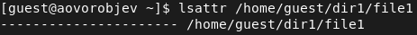{ #fig:001 width=70% }  
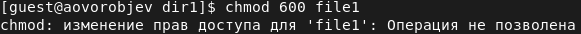{ #fig:002 width=70% }  
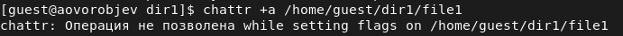{ #fig:003 width=70% }  

## Практическая работа с расширенным атрибутом a

### Результат

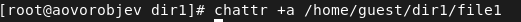{ #fig:004 width=70% }  
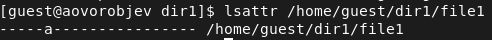{ #fig:005 width=70% }
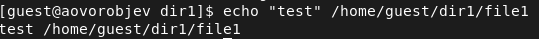{ #fig:006 width=70% }  
{ #fig:007 width=70% }  
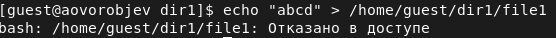{ #fig:008 width=70% }  
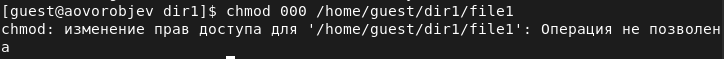{ #fig:009 width=70% }  
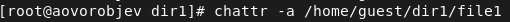{ #fig:010 width=70% }  
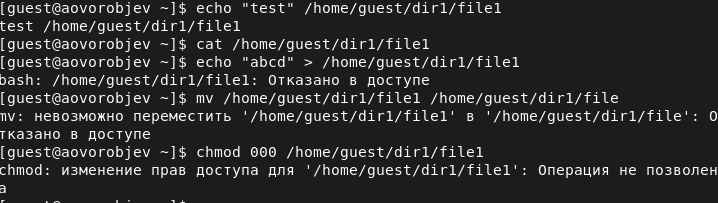{ #fig:011 width=70% }  

## Практическая работа с расширенным атрибутом i

### Результат

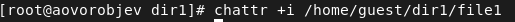{ #fig:012 width=70% }  
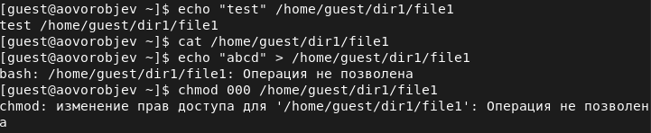{ #fig:013 width=70% }  

# Выводы

В результате выполнения работы повысил свои навыки использования интерфейса командой строки (CLI), познакомился на примерах с тем, как используются основные и расширенные атрибуты при разграничении доступа. Опробовал действие на практике расширенных атрибутов «а» и «i».
