---
# Front matter
lang: ru-RU
title: "Отчет по лабораторной работе №4"
subtitle: "Дискреционное разграничение прав в Linux. Расширенные атрибуты"
author: "Александр Олегович Воробьев"

# Formatting
toc-title: "Содержание"
toc: true # Table of contents
fontsize: 12pt
linestretch: 1.5
papersize: a4paper
documentclass: scrreprt
polyglossia-lang: russian
polyglossia-otherlangs: english
mainfont: PT Serif
romanfont: PT Serif
sansfont: PT Sans
monofont: PT Mono
mainfontoptions: Ligatures=TeX
romanfontoptions: Ligatures=TeX
sansfontoptions: Ligatures=TeX,Scale=MatchLowercase
monofontoptions: Scale=MatchLowercase
indent: true
pdf-engine: lualatex
header-includes:
  - \linepenalty=10 # the penalty added to the badness of each line within a paragraph (no associated penalty node) Increasing the value makes tex try to have fewer lines in the paragraph.
  - \interlinepenalty=0 # value of the penalty (node) added after each line of a paragraph.
  - \hyphenpenalty=50 # the penalty for line breaking at an automatically inserted hyphen
  - \exhyphenpenalty=50 # the penalty for line breaking at an explicit hyphen
  - \binoppenalty=700 # the penalty for breaking a line at a binary operator
  - \relpenalty=500 # the penalty for breaking a line at a relation
  - \clubpenalty=150 # extra penalty for breaking after first line of a paragraph
  - \widowpenalty=150 # extra penalty for breaking before last line of a paragraph
  - \displaywidowpenalty=50 # extra penalty for breaking before last line before a display math
  - \brokenpenalty=100 # extra penalty for page breaking after a hyphenated line
  - \predisplaypenalty=10000 # penalty for breaking before a display
  - \postdisplaypenalty=0 # penalty for breaking after a display
  - \floatingpenalty = 20000 # penalty for splitting an insertion (can only be split footnote in standard LaTeX)
  - \raggedbottom # or \flushbottom
  - \usepackage{float} # keep figures where there are in the text
  - \floatplacement{figure}{H} # keep figures where there are in the text
---

# Цель работы

Получение практических навыков работы в консоли с расширенными атрибутами файлов

# Последовательность выполнения работы

1. От имени пользователя guest определите расширенные атрибуты файла /home/guest/dir1/file1 командой
lsattr /home/guest/dir1/file1

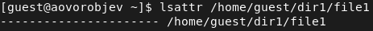{ #fig:001 width=70% }  

2. Установите командой
chmod 600 file1
на файл file1 права, разрешающие чтение и запись для владельца фай- ла.

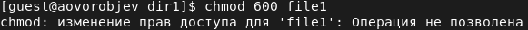{ #fig:002 width=70% }

3. Попробуйтеустановитьнафайл/home/guest/dir1/file1расширен- ный атрибут a от имени пользователя guest:
chattr +a /home/guest/dir1/file1

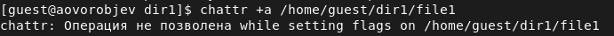{ #fig:003 width=70% }

4. Зайдите на третью консоль с правами администратора либо повысьте свои права с помощью команды su. Попробуйте установить расширен- ный атрибут a на файл /home/guest/dir1/file1 от имени суперполь- зователя:
  chattr +a /home/guest/dir1/file1

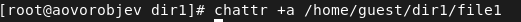{ #fig:004 width=70% }

5. От пользователя guest проверьте правильность установления атрибута:
  lsattr /home/guest/dir1/file1

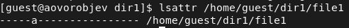{ #fig:005 width=70% }

6. Выполнитедозаписьвфайлfile1слова«test»командой
echo "test" /home/guest/dir1/file1
После этого выполните чтение файла file1 командой cat /home/guest/dir1/file1

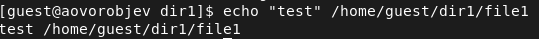{ #fig:006 width=70% }  
{ #fig:007 width=70% }

7. Попробуйтеудалитьфайлfile1либостеретьимеющуюсявнёминфор- мацию командой
echo "abcd" > /home/guest/dirl/file1

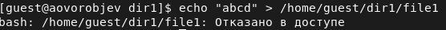{ #fig:008 width=70% }

8. Попробуйте с помощью команды chmod 000 file1
установить на файл file1 права, например, запрещающие чтение и за- пись для владельца файла. Удалось ли вам успешно выполнить указан- ные команды?

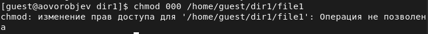{ #fig:009 width=70% }  

9. Снимитерасширенныйатрибутaсфайла/home/guest/dirl/file1от имени суперпользователя командой
chattr -a /home/guest/dir1/file1

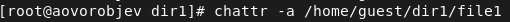{ #fig:010 width=70% }  

Повторите операции, которые вам ранее не удавалось выполнить. Ваши наблюдения занесите в отчёт.

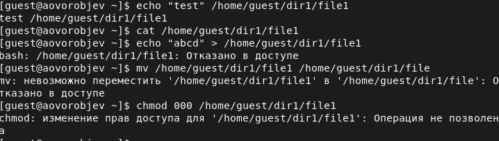{ #fig:011 width=70% }

10. Повторитевашидействияпошагам,замениватрибут«a»атрибутом«i». Удалось ли вам дозаписать информацию в файл? Ваши наблюдения за- несите в отчёт.

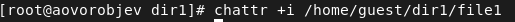{ #fig:012 width=70% }  
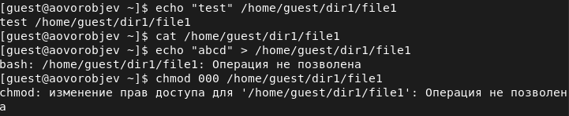{ #fig:013 width=70% }

# Выводы

В результате выполнения работы вы повысил свои навыки использова- ния интерфейса командой строки (CLI), познакомился на примерах с тем, как используются основные и расширенные атрибуты при разграничении доступа. Имели возможность связать теорию дискреционного разделения доступа (дискреционная политика безопасности) с её реализацией на прак- тике в ОС Linux. Составил наглядные таблицы, поясняющие какие опера- ции возможны при тех или иных установленных правах. Опробовал дей- ствие на практике расширенных атрибутов «а» и «i».