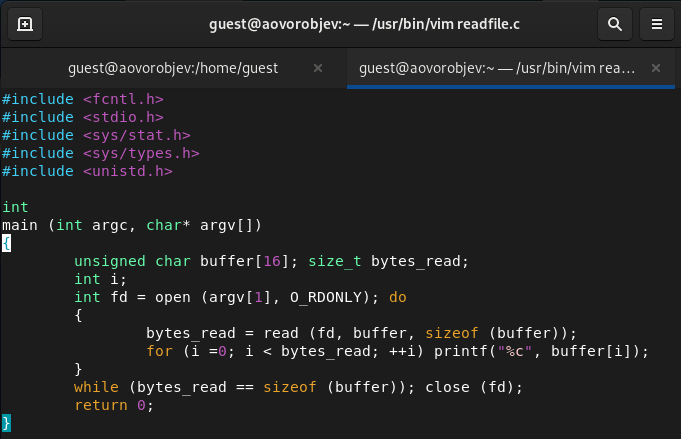
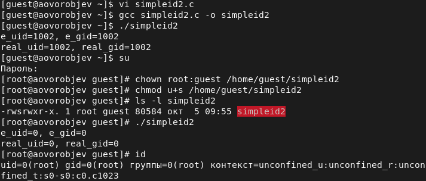
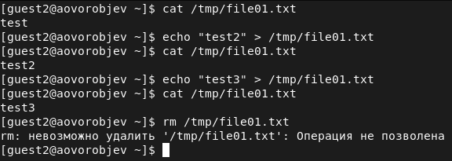
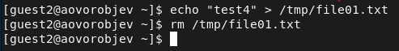

---
## Front matter
lang: ru-RU
title: Дискреционное разграничение прав в Linux. Исследование влияния дополнительных атрибутов
author: Александр Воробьев

institute: RUDN University

date: 5 октября, 2022, Москва, Россия

## Formatting
mainfont: PT Serif
romanfont: PT Serif
sansfont: PT Sans
monofont: PT Mono
toc: false
slide_level: 2
theme: metropolis
header-includes:
 - \metroset{progressbar=frametitle,sectionpage=progressbar,numbering=fraction}
 - '\makeatletter'
 - '\beamer@ignorenonframefalse'
 - '\makeatother'
aspectratio: 43
section-titles: true

---

# Цель лабораторной работы

Изучение механизмов изменения идентификаторов, применения SetUID- и Sticky-битов. Получение практических навыков работы в консоли с дополнительными атрибутами. Рассмотрение работы механизма смены идентификатора процессов пользователей, а также влияние бита Sticky на запись и удаление файлов.

# Процесс выполнения лабораторной работы

## Выполнение работы

1. Создание программы

2. Практическая работа с дополнительными атрибутами. SetUID- и SetGID- биты.

3. Исследование Sticky-бита

## Создание программы

### Результат

{ #fig:001 width=70% }  

## Практическая работа с дополнительными атрибутами. SetUID- и SetGID- биты.

### Результат

{ #fig:002 width=70% }  

## Исследование Sticky-бита

### Результат

{ #fig:003 width=70% }  
{ #fig:004 width=70% }  

# Выводы

Изучил механизмы изменения идентификаторов, примененив SetUID- и Sticky-биты. Получил практические навыкы работы в консоли с дополнительными атрибутами. Рассмотрел работы механизмов смены идентификаторов процесса пользователей, а также влияние бита Sticky на запись и удаление файлов.
