---
# Front matter
lang: ru-RU
title: "Отчет по лабораторной работе №5"
subtitle: "Дискреционное разграничение прав в Linux. Исследование влияния дополнительных атрибутов"
author: "Александр Олегович Воробьев"

# Formatting
toc-title: "Содержание"
toc: true # Table of contents
fontsize: 12pt
linestretch: 1.5
papersize: a4paper
documentclass: scrreprt
polyglossia-lang: russian
polyglossia-otherlangs: english
mainfont: PT Serif
romanfont: PT Serif
sansfont: PT Sans
monofont: PT Mono
mainfontoptions: Ligatures=TeX
romanfontoptions: Ligatures=TeX
sansfontoptions: Ligatures=TeX,Scale=MatchLowercase
monofontoptions: Scale=MatchLowercase
indent: true
pdf-engine: lualatex
header-includes:
  - \linepenalty=10 # the penalty added to the badness of each line within a paragraph (no associated penalty node) Increasing the value makes tex try to have fewer lines in the paragraph.
  - \interlinepenalty=0 # value of the penalty (node) added after each line of a paragraph.
  - \hyphenpenalty=50 # the penalty for line breaking at an automatically inserted hyphen
  - \exhyphenpenalty=50 # the penalty for line breaking at an explicit hyphen
  - \binoppenalty=700 # the penalty for breaking a line at a binary operator
  - \relpenalty=500 # the penalty for breaking a line at a relation
  - \clubpenalty=150 # extra penalty for breaking after first line of a paragraph
  - \widowpenalty=150 # extra penalty for breaking before last line of a paragraph
  - \displaywidowpenalty=50 # extra penalty for breaking before last line before a display math
  - \brokenpenalty=100 # extra penalty for page breaking after a hyphenated line
  - \predisplaypenalty=10000 # penalty for breaking before a display
  - \postdisplaypenalty=0 # penalty for breaking after a display
  - \floatingpenalty = 20000 # penalty for splitting an insertion (can only be split footnote in standard LaTeX)
  - \raggedbottom # or \flushbottom
  - \usepackage{float} # keep figures where there are in the text
  - \floatplacement{figure}{H} # keep figures where there are in the text
---

# Цель работы

Изучение механизмов изменения идентификаторов, применения SetUID- и Sticky-битов. Получение практических навыков работы в консоли с дополнительными атрибутами. Рассмотрение работы механизма смены идентификатора процессов пользователей, а также влияние бита Sticky на запись и удаление файлов.

# Последовательность выполнения работы

## Подготовка лабораторного стенда

1. Установка gcc

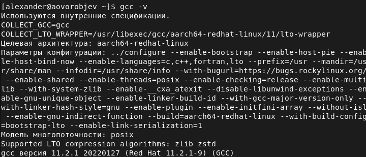{ #fig:001 width=70% }  

## Создание программы  

1. Войдите в систему от имени пользователя guest.  
2. Создайте программу simpleid.c:  

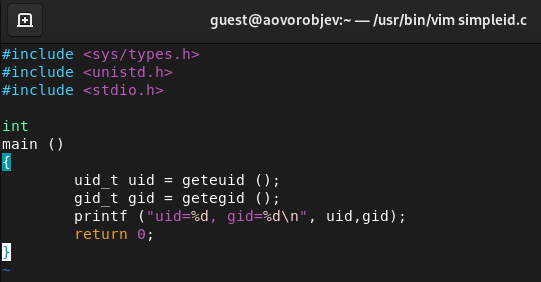{ #fig:002 width=70% }

3. Скомплилируйте программу и убедитесь, что файл программы создан:  
  gcc simpleid.c -o simpleid  
4. Выполните программу simpleid:  
./simpleid  
5. Выполните системную программу id:  
id  
и сравните полученный вами результат с данными предыдущего пункта
задания.  

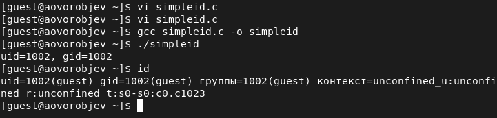{ #fig:003 width=70% }

6. Усложните программу, добавив вывод действительных идентификато-
ров:  

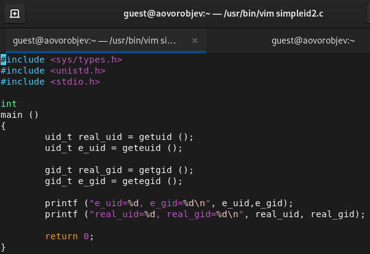{ #fig:004 width=70% }

7. Скомпилируйте и запустите simpleid2.c:  
  gcc simpleid2.c -o simpleid2  
./simpleid2  
8. От имени суперпользователя выполните команды:  
   chown root:guest /home/guest/simpleid2  
   chmod u+s /home/guest/simpleid2  
9. Используйте sudo или повысьте временно свои права с помощью su.  
Поясните, что делают эти команды.  
10. Выполнитепроверкуправильностиустановкиновыхатрибутовисмены  
владельца файла simpleid2:  
   ls -l simpleid2  
11. Запустите simpleid2 и id:  
./simpleid2  
id  
Сравните результаты.  
12. Проделайте тоже самое относительно SetGID-бита.  

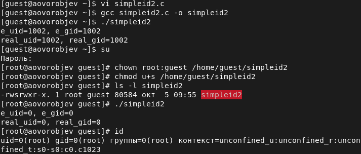{ #fig:005 width=70% }

13. Создайте программу readfile.c:  
14. Откомпилируйте её.  
   gcc readfile.c -o readfile  

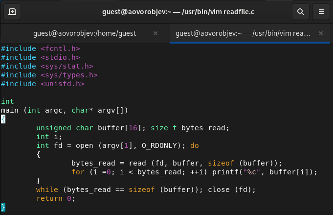{ #fig:006 width=70% }  

15. Смените владельца у файла readfile.c (или любого другого текстового файла в системе) и измените права так, чтобы только суперпользователь (root) мог прочитать его, a guest не мог.  

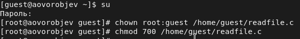{ #fig:007 width=70% }  

16. Проверьте, что пользователь guest не может прочитать файл readfile.c.  

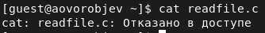{ #fig:008 width=70% }  

17. Смените у программы readfile владельца и установите SetU’D-бит.  

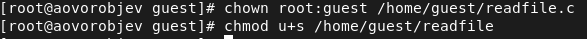{ #fig:009 width=70% }  

18. Проверьте, может ли программа readfile прочитать файл readfile.c?  

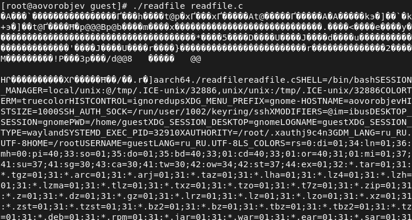{ #fig:010 width=70% }  

19. Проверьте, может ли программа readfile прочитать файл /etc/shadow?  

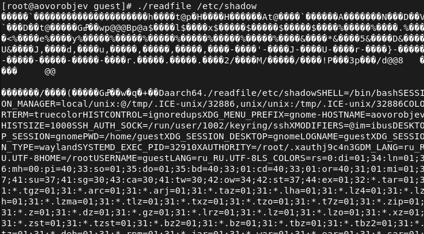{ #fig:011 width=70% }

## Исследование Sticky-бита 

1. Выясните, установлен ли атрибут Sticky на директории /tmp, для чего выполните команду  
ls -l / | grep tmp  
2. Отименипользователяguestсоздайтефайлfile01.txtвдиректории/tmp со словом test:
echo "test" > /tmp/file01.txt  
3. Просмотрите атрибуты у только что созданного файла и разрешите чте- ние и запись для категории пользователей «все остальные»:  
ls -l /tmp/file01.txt  
chmod o+rw /tmp/file01.txt  
   ls -l /tmp/file01.txt  

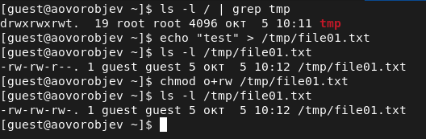{ #fig:012 width=70% }  

4. От пользователя guest2 (не являющегося владельцем) попробуйте про- читать файл /tmp/file01.txt:  
cat /tmp/file01.txt  
5. От пользователя guest2 попробуйте дозаписать в файл /tmp/file01.txt слово test2 командой  
echo "test2" > /tmp/file01.txt  
Удалось ли вам выполнить операцию?  
6. Проверьте содержимое файла командой  
   cat /tmp/file01.txt  
7. От пользователя guest2 попробуйте записать в файл /tmp/file01.txt  
слово test3, стерев при этом всю имеющуюся в файле информацию ко- мандой  
echo "test3" > /tmp/file01.txt  
Удалось ли вам выполнить операцию?  
8. Проверьте содержимое файла командой  
   cat /tmp/file01.txt  
9. Отпользователяguest2попробуйтеудалитьфайл/tmp/file01.txtкомандой  
    rm /tmp/fileOl.txt  

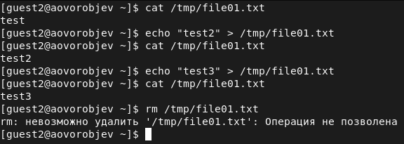{ #fig:013 width=70% }  
10. Повысьте свои права до суперпользователя следующей командой  
su -  
и выполните после этого команду, снимающую атрибут t (Sticky-бит) с директории /tmp:
chmod -t /tmp  
11. Покиньте режим суперпользователя командой  
exit  
12. От пользователя guest2 проверьте, что атрибута t у директории /tmp нет:
   ls -l / | grep tmp  

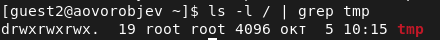{ #fig:014 width=70% }

13. Повторите предыдущие шаги. Какие наблюдаются изменения?  
14. Удалось ли вам удалить файл от имени пользователя, не являющегося
его владельцем? Ваши наблюдения занесите в отчёт.  

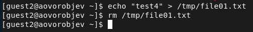{ #fig:015 width=70% }

15. Повысьте свои права до суперпользователя и верните атрибут t на ди- ректорию /tmp:  
   su -  
   chmod +t /tmp  
   exit  

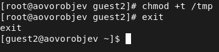{ #fig:016 width=70% }

# Выводы

Изучил механизмы изменения идентификаторов, примененив SetUID- и Sticky-биты. Получил практические навыкы работы в консоли с дополнительными атрибутами. Рассмотрел работы механизмов смены идентификаторов процесса пользователей, а также влияние бита Sticky на запись и удаление файлов.
