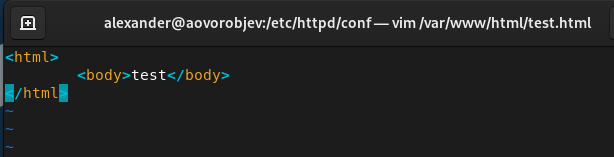
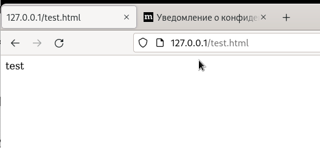
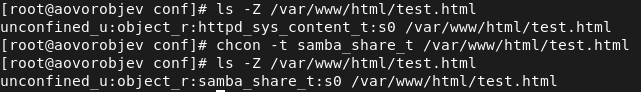
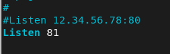
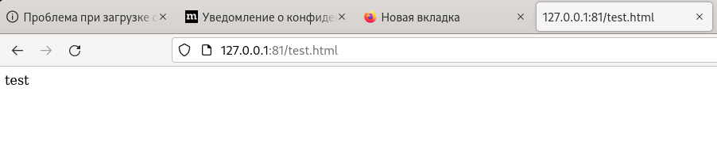
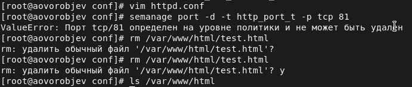

---
## Front matter
lang: ru-RU
title: Мандатное разграничение прав в Linux
author: Александр Воробьев

institute: RUDN University

date: 15 октября, 2022, Москва, Россия

## Formatting
mainfont: PT Serif
romanfont: PT Serif
sansfont: PT Sans
monofont: PT Mono
toc: false
slide_level: 2
theme: metropolis
header-includes:
 - \metroset{progressbar=frametitle,sectionpage=progressbar,numbering=fraction}
 - '\makeatletter'
 - '\beamer@ignorenonframefalse'
 - '\makeatother'
aspectratio: 43
section-titles: true

---

# Цель лабораторной работы

Развить навыки администрирования ОС Linux. Получить первое практическое знакомство с технологией SELinux.  
Проверить работу SELinx на практике совместно с веб-сервером
Apache.

# Процесс выполнения лабораторной работы

## Выполнение работы

1. Создание файла

2. Проверить работу SELinx на практике совместно с веб-сервером Apache.

3. Веб-сервер Apache на прослушивание ТСР-порта 81

## Создание файла

### Результат

{ #fig:001 width=70% }  

## Проверить работу SELinx на практике совместно с веб-сервером Apache.

### Результат

{ #fig:002 width=70% }  
{ #fig:003 width=70% } 

## Веб-сервер Apache на прослушивание ТСР-порта 81

### Результат

{ #fig:004 width=70% }  
{ #fig:005 width=70% }  
{ #fig:006 width=70% }  

# Выводы

Развил навыки администрирования ОС Linux. Получил первое практическое знакомство с технологией SELinux.  
Проверил работу SELinx на практике совместно с веб-сервером
Apache.
