---
# Front matter
lang: ru-RU
title: "Отчет по лабораторной работе №6"
subtitle: "Мандатное разграничение прав в Linux"
author: "Александр Олегович Воробьев"

# Formatting
toc-title: "Содержание"
toc: true # Table of contents
fontsize: 12pt
linestretch: 1.5
papersize: a4paper
documentclass: scrreprt
polyglossia-lang: russian
polyglossia-otherlangs: english
mainfont: PT Serif
romanfont: PT Serif
sansfont: PT Sans
monofont: PT Mono
mainfontoptions: Ligatures=TeX
romanfontoptions: Ligatures=TeX
sansfontoptions: Ligatures=TeX,Scale=MatchLowercase
monofontoptions: Scale=MatchLowercase
indent: true
pdf-engine: lualatex
header-includes:
  - \linepenalty=10 # the penalty added to the badness of each line within a paragraph (no associated penalty node) Increasing the value makes tex try to have fewer lines in the paragraph.
  - \interlinepenalty=0 # value of the penalty (node) added after each line of a paragraph.
  - \hyphenpenalty=50 # the penalty for line breaking at an automatically inserted hyphen
  - \exhyphenpenalty=50 # the penalty for line breaking at an explicit hyphen
  - \binoppenalty=700 # the penalty for breaking a line at a binary operator
  - \relpenalty=500 # the penalty for breaking a line at a relation
  - \clubpenalty=150 # extra penalty for breaking after first line of a paragraph
  - \widowpenalty=150 # extra penalty for breaking before last line of a paragraph
  - \displaywidowpenalty=50 # extra penalty for breaking before last line before a display math
  - \brokenpenalty=100 # extra penalty for page breaking after a hyphenated line
  - \predisplaypenalty=10000 # penalty for breaking before a display
  - \postdisplaypenalty=0 # penalty for breaking after a display
  - \floatingpenalty = 20000 # penalty for splitting an insertion (can only be split footnote in standard LaTeX)
  - \raggedbottom # or \flushbottom
  - \usepackage{float} # keep figures where there are in the text
  - \floatplacement{figure}{H} # keep figures where there are in the text
---

# Цель работы

Развить навыки администрирования ОС Linux. Получить первое практическое знакомство с технологией SELinux.

Проверить работу SELinx на практике совместно с веб-сервером
Apache.

# Последовательность выполнения работы

1. Войдите в систему с полученными учётными данными и убедитесь, что SELinux работает в режиме enforcing политики targeted с помощью ко- манд getenforce и sestatus.  

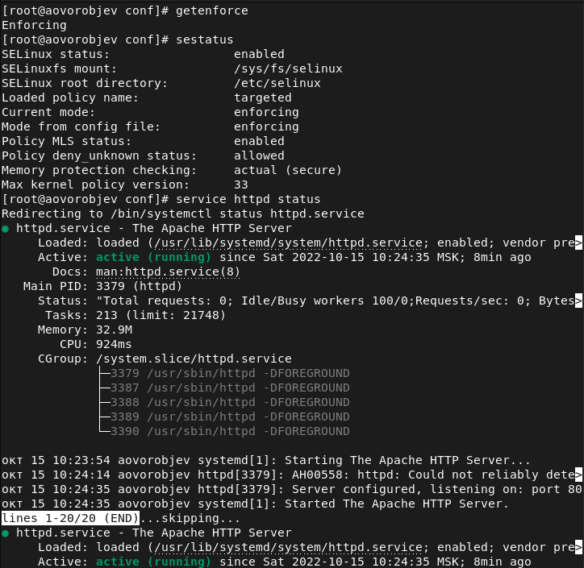{ #fig:001 width=70% }

2. Обратитесь с помощью браузера к веб-серверу, запущенному на вашем компьютере, и убедитесь, что последний работает:  
service httpd status  
или  
  /etc/rc.d/init.d/httpd status  
Если не работает, запустите его так же, но с параметром start.  

3. Найдитевеб-серверApacheвспискепроцессов,определитеегоконтекст безопасности и занесите эту информацию в отчёт. Например, можно ис-
пользовать команду  
  ps auxZ | grep httpd  
или  
  ps -eZ | grep httpd   

4. Посмотрите текущее состояние переключателей SELinux для Apache с помощью команды
sestatus -bigrep httpd  
Обратите внимание, что многие из них находятся в положении «off».  

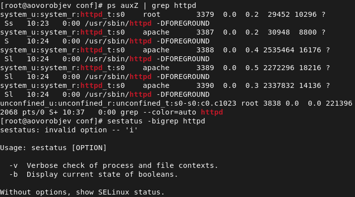{ #fig:002 width=70% }

5. Посмотритестатистикупополитикеспомощьюкомандыseinfo,также определите множество пользователей, ролей, типов.  

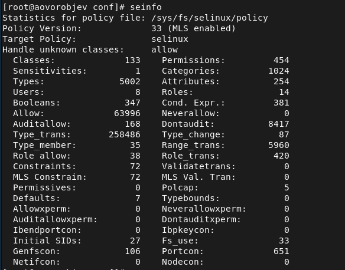{ #fig:003 width=70% }

6. Определите тип файлов и поддиректорий, находящихся в директории /var/www, с помощью команды  
ls -lZ /var/www  

7. Определите тип файлов, находящихся в директории /var/www/html: ls -lZ /var/www/html  

8. Определите круг пользователей, которым разрешено создание файлов в директории /var/www/html.  

9. Создайте от имени суперпользователя (так как в дистрибутиве по- сле установки только ему разрешена запись в директорию) html-файл /var/www/html/test.html следующего содержания:  
<html>  
<body>test</body>  
</html>  

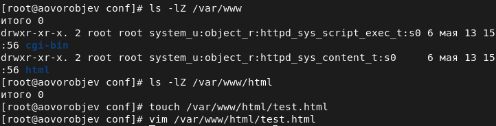{ #fig:004 width=70% }

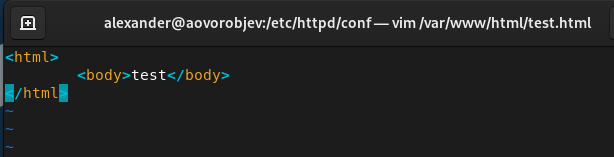{ #fig:005 width=70% }

10. Проверьте контекст созданного вами файла. Занесите в отчёт контекст, присваиваемый по умолчанию вновь созданным файлам в директории /var/www/html.  

11. Обратитесь к файлу через веб-сервер, введя в браузере адрес http://127.0.0.1/test.html. Убедитесь, что файл был успеш- но отображён.  

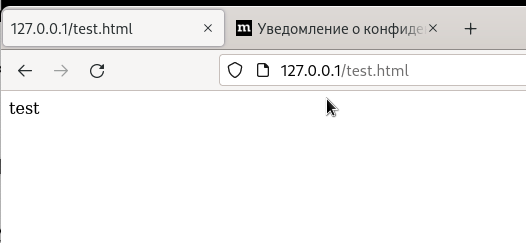{ #fig:006 width=70% }  

12. Изучите справку man httpd_selinux и выясните, какие контек- сты файлов определены для httpd. Сопоставьте их с типом файла test.html. Проверить контекст файла можно командой ls -Z.
ls -Z /var/www/html/test.html
Рассмотрим полученный контекст детально. Обратите внимание, что так как по умолчанию пользователи CentOS являются свободными от типа (unconfined в переводе с англ. означает свободный), созданному нами файлу test.html был сопоставлен SELinux, пользователь unconfined_u. Это первая часть контекста.
Далее политика ролевого разделения доступа RBAC используется про- цессами, но не файлами, поэтому роли не имеют никакого значения для файлов. Роль object_r используется по умолчанию для файлов на «по- стоянных» носителях и на сетевых файловых системах. (В директории /ргос файлы, относящиеся к процессам, могут иметь роль system_r. Если активна политика MLS, то могут использоваться и другие роли, например, secadm_r. Данный случай мы рассматривать не будем, как и предназначение :s0).
Тип httpd_sys_content_t позволяет процессу httpd получить доступ к фай- лу. Благодаря наличию последнего типа мы получили доступ к файлу при обращении к нему через браузер.  

13. Измените контекст файла /var/www/html/test.html с httpd_sys_content_t на любой другой, к которому процесс httpd не должен иметь доступа, например, на samba_share_t:  
chcon -t samba_share_t /var/www/html/test.html  
   ls -Z /var/www/html/test.html  

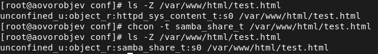{ #fig:007 width=70% }  

14. Попробуйте ещё раз получить доступ к файлу через веб-сервер, введя в
браузере адрес http://127.0.0.1/test.html. Вы должны получить сообщение об ошибке:
Forbidden
You don't have permission to access /test.html on this server.  

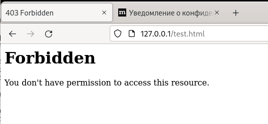{ #fig:008 width=70% }  

15. Проанализируйтеситуацию.Почемуфайлнебылотображён,еслиправа доступа позволяют читать этот файл любому пользователю?
ls -l /var/www/html/test.html
Просмотрите log-файлы веб-сервера Apache. Также просмотрите си- стемный лог-файл:
   tail /var/log/messages
Если в системе окажутся запущенными процессы setroubleshootd и audtd, то вы также сможете увидеть ошибки, аналогичные указанным выше, в файле /var/log/audit/audit.log. Проверьте это утвержде- ние самостоятельно.  

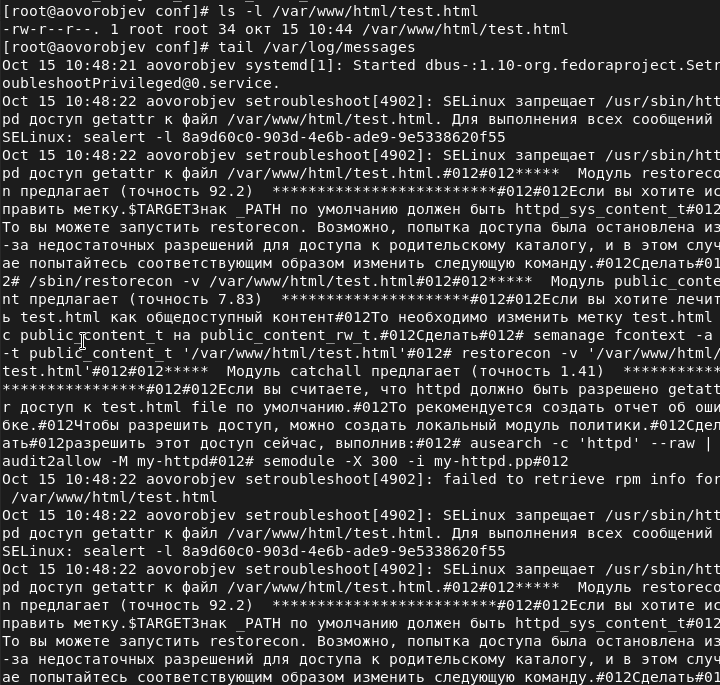{ #fig:009 width=70% }  

16. Попробуйте запустить веб-сервер Apache на прослушивание ТСР-порта 81 (а не 80, как рекомендует IANA и прописано в /etc/services). Для этого в файле /etc/httpd/httpd.conf найдите строчку Listen 80 и замените её на Listen 81.  

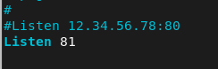{ #fig:010 width=70% }  

17. Выполните перезапуск веб-сервера Apache. Произошёл сбой? Поясните почему?  

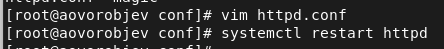{ #fig:011 width=70% }

18. Проанализируйте лог-файлы:  
tail -nl /var/log/messages  
Просмотрите файлы /var/log/http/error_log, /var/log/http/access_log и /var/log/audit/audit.log и выясните, в каких файлах появились записи.  

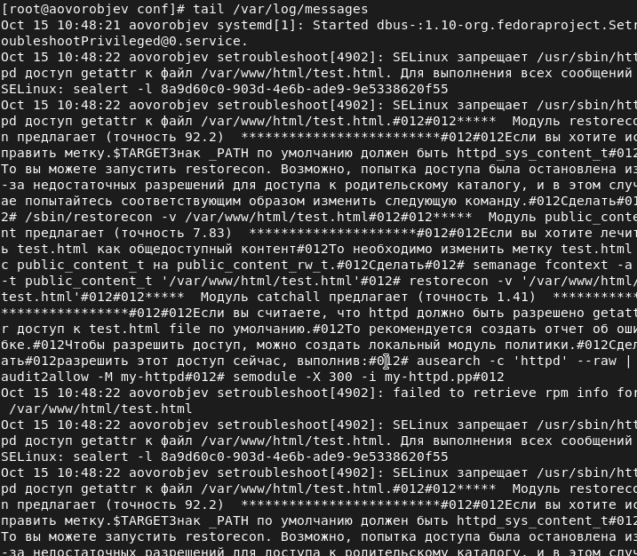{ #fig:012 width=70% }  

19. Выполните команду
   semanage port -a -t http_port_t -р tcp 81
После этого проверьте список портов командой
   semanage port -l | grep http_port_t
Убедитесь, что порт 81 появился в списке.  

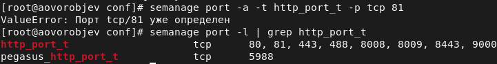{ #fig:013 width=70% }  

20. Попробуйтезапуститьвеб-серверApacheещёраз.Понялиливы,почему
он сейчас запустился, а в предыдущем случае не смог?  

21. Вернитеконтекстhttpd_sys_cоntent__tкфайлу/var/www/html/test.html:
   chcon -t httpd_sys_content_t /var/www/html/test.html
После этого попробуйте получить доступ к файлу через веб-сервер, вве- дя в браузере адрес http://127.0.0.1:81/test.html.
Вы должны увидеть содержимое файла — слово «test».  

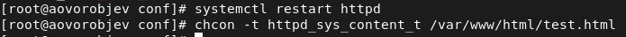{ #fig:014 width=70% }  

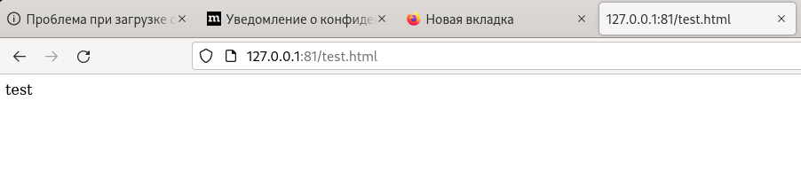{ #fig:015 width=70% }  

22. Исправьтеобратноконфигурационныйфайлapache,вернувListen80.  

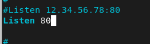{ #fig:016 width=70% }  

23. Удалите привязку http_port_t к 81 порту:
   semanage port -d -t http_port_t -p tcp 81
и проверьте, что порт 81 удалён.  
24. Удалитефайл/var/www/html/test.html:
   rm /var/www/html/test.html  

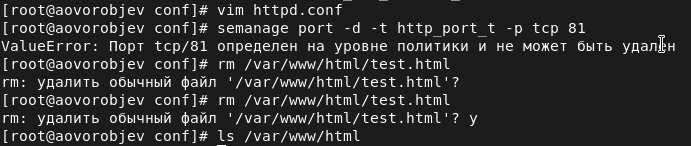{ #fig:017 width=70% }  

# Выводы

Развил навыки администрирования ОС Linux. Получил первое практическое знакомство с технологией SELinux.  
Проверил работу SELinx на практике совместно с веб-сервером
Apache.
