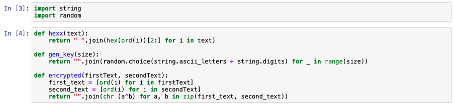
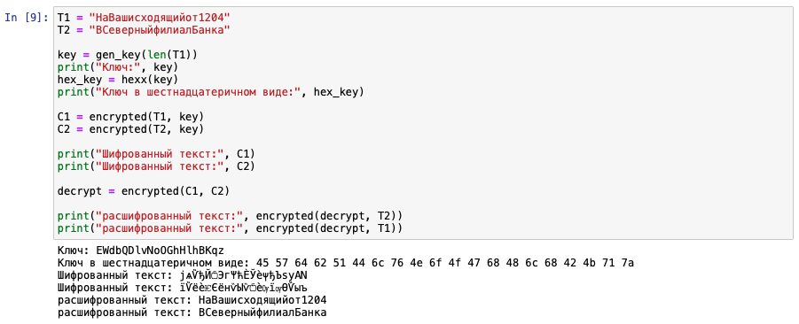

---
## Front matter
lang: ru-RU
title: "Элементы криптографии. Шифрование (кодирование) различных исходных текстов одним ключом"
author: Александр Воробьев

institute: RUDN University

date: 18 октября, 2022, Москва, Россия

## Formatting
mainfont: PT Serif
romanfont: PT Serif
sansfont: PT Sans
monofont: PT Mono
toc: false
slide_level: 2
theme: metropolis
header-includes:
 - \metroset{progressbar=frametitle,sectionpage=progressbar,numbering=fraction}
 - '\makeatletter'
 - '\beamer@ignorenonframefalse'
 - '\makeatother'
aspectratio: 43
section-titles: true

---

# Цель лабораторной работы

Освоить на практике применение режима однократного гаммирования на примере кодирования различных исходных текстов одним ключом.

# Процесс выполнения лабораторной работы

## Блок функции для расчетов

### Результат

{ #fig:001 width=70% }

## Блок обработки данных

### Результат

{ #fig:002 width=70% }  

# Выводы

Освоил на практике применение режима однократного гаммирования на примере кодирования различных исходных текстов одним ключом.

